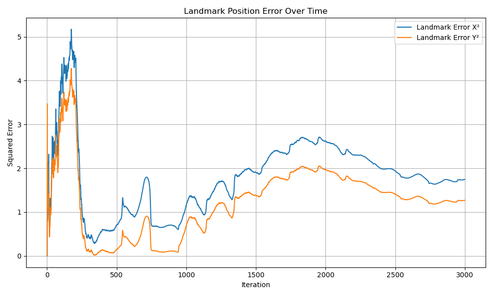
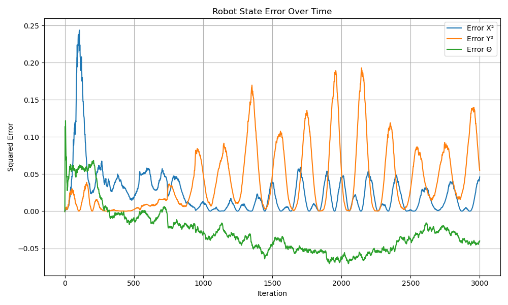

# EKF-SLAM (Eigen-based)
This repository contains a demonstration of an Extended Kalman Filter (EKF) for Simultaneous Localization and Mapping (SLAM) implemented in C++ with the [Eigen](https://eigen.tuxfamily.org/) library for matrix operations. The code simulates a unicycle robot navigating a 2D environment while estimating both its own pose and the positions of several landmarks.


---

## Table of Contents

- [Overview](#overview)
- [Key Components](#key-components)
  - [Utility Functions](#utility-functions)
  - [Motion and Jacobian Models](#motion-and-jacobian-models)
  - [Observation Models](#observation-models)
  - [Error Computation](#error-computation)
- [EKF-SLAM Process](#ekf-slam-process)
- [Compilation and Execution](#compilation-and-execution)
- [Results and Visualizations](#results-and-visualizations)
- [Notes and Extensions](#notes-and-extensions)

---

## Overview

This project demonstrates a simplified EKF-SLAM system where:

- **Robot State**: Modeled as a unicycle with state $\left[ x, y, \theta \right]$.
- **Landmark State**: Each landmark has a 2D position $\([l_x, l_y]\)$.  
- **Full State Vector**: Combines the robot state and all landmark positions:
  X = [x, y, θ, lx1, ly1, ..., lxn, lyn]ᵀ

- **Covariance Matrix \(P\)**: Reflects uncertainty in both the robot pose and the landmark estimates.

The code uses noisy control inputs and simulated measurements to update the state estimate via standard EKF prediction and update steps.

---

## Key Components

### Utility Functions

- **`wrapToPi(double angle)`**  
  Normalizes an angle to the range \([-π, π]\), ensuring consistency when working with angular values.

- **`landmarks_generate(int l, int n, bool random_landmark)`**  
  Generates \(n\) landmarks within the square \([-l, l] \times [-l, l]\):
  - When `random_landmark` is `true`, landmarks are uniformly randomized.
  - When `false`, a fixed pattern is used (the current code provides two fixed landmarks).

### Motion and Jacobian Models

- **`robot_motion(const Eigen::Vector3d &X, double v, double w, double dt)`**  
  Updates the robot’s state based on control inputs:
  - For nonzero angular velocity \(w\), it uses a turning model.
  - For $\(w \approx 0\)$, it approximates straight-line motion.

- **`jacobian_robot_motion(const Eigen::Vector3d &X, double v, double w, double dt)`**  
  Computes the Jacobian of the motion model with respect to the robot’s state. This is essential for propagating the state covariance during the prediction step.

### Observation Models

- **`inverse_landmark_obsv(const Eigen::Vector3d &Xr, const Eigen::Vector2d &z)`**  
  Converts a measurement $\(z = [\text{range}, \text{bearing}]\)$ into a landmark position relative to the robot’s state \(X_r\).  
  Also returns:
  - **`dR`**: The Jacobian with respect to the robot state.
  - **`dL`**: The Jacobian with respect to the measurement.

- **`landmark_estimate(const Eigen::Vector3d &Xr, const Eigen::Vector2d &L)`**  
  Predicts the measurement (range and bearing) given the robot state and a landmark’s position. It also computes the Jacobian with respect to the robot and landmark states, used in the EKF update.

### Error Computation

- **`robot_error(const Eigen::Vector3d &X_est, const Eigen::Vector3d &X_true)`**  
  Computes the squared errors in the \(x\) and \(y\) coordinates and the difference in orientation (wrapped to \([-π, π]\)).

- **`landmark_sum_mse(const Eigen::Matrix2Xd &L_real, const Eigen::Matrix2Xd &L_est)`**  
  Computes the sum of squared errors between the true and estimated landmark positions.

---

## EKF-SLAM Process

The main EKF loop (running for 3000 iterations) comprises several key steps:

1. **Landmark Initialization**  
   - A shuffled observation sequence determines the order in which landmarks are first observed.
   - For each new landmark, a simulated measurement is generated (using noise), and the inverse observation model initializes its position in the state vector.
   - The landmark’s covariance is set high (with a block in \(P\) set to 10,000 on the diagonal), and cross-correlation terms with the robot state are updated.

2. **Robot State Prediction**  
   - The ground truth state is updated using the motion model.
   - The robot state in the state vector \(X\) is updated with noisy control inputs.
   - The covariance \(P\) is propagated using the motion model’s Jacobian.  
   - Cross-covariance between the robot and observed landmarks is updated accordingly.

3. **Measurement Update**  
   - For each observed landmark, a new simulated measurement (with added noise) is generated.
   - The forward observation model predicts the expected measurement.
   - The innovation (measurement residual) is computed.
   - A measurement Jacobian is constructed (affecting only the robot state and the corresponding landmark).
   - The EKF update equations are applied to correct both the state vector \(X\) and covariance \(P\).
   - Additionally, an EKF-free landmark estimate is computed using the inverse observation model for comparison.

4. **Error Logging**  
   - Errors for the robot state and landmark positions are logged at each iteration.
   - The logs are saved to `robot_error.txt` and `landmark_error.txt` for later analysis and visualization.

---

## Compilation and Execution

Ensure you have the Eigen library installed (e.g., on Ubuntu run:  
```bash
sudo apt-get install libeigen3-dev
```

## Results and Visualizations




